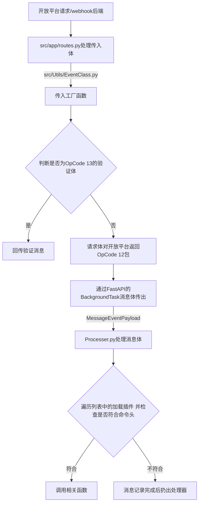

# 目录结构

让我们先来了解一下项目结构

```bash 项目结构
AxTBot-Public
├─.venv   <-- 虚拟环境
├─data    <-- 数据目录
├─logs    <-- 日志目录（可更改）
├─plugins <-- 插件目录
├─src     <-- 源码目录
│  ├─app
│  │  ├─__init__.py
│  │  ├─routes.py
│  │  └─exceptions.py
│  └──Utils
│     ├─__init__.py
│     ├─AutoUpdate.py
│     ├─Config.py
│     ├─ConfigClass.py
│     ├─ConfigCli.py
│     ├─Database.py
│     ├─EventClass.py
│     ├─Logger.py
│     └─Processer.py
├─main.py  <-- 入口文件
├─config.yaml  <-- 配置文件
└─pyproject.toml  <-- 项目文件
```

我们的项目结构主要分为以下几部分：

1. 源码目录 即src目录
2. 插件目录 即plugins目录
3. 数据目录 即data目录

处理消息的逻辑如下：



